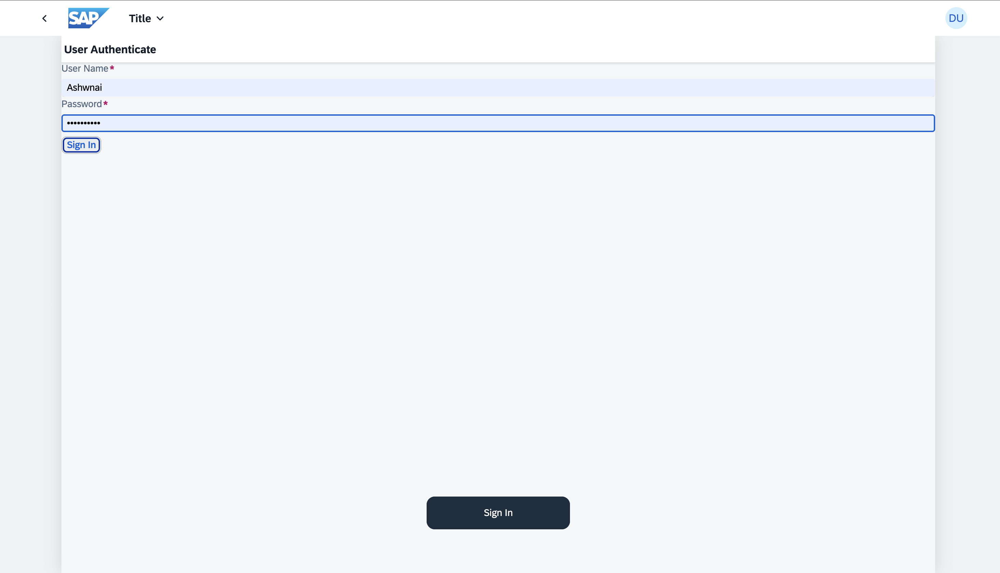
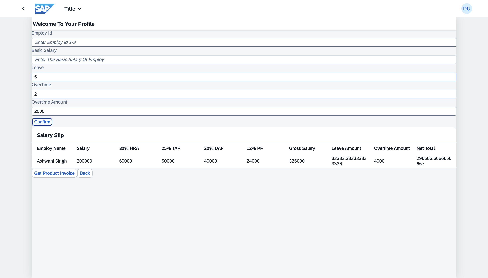
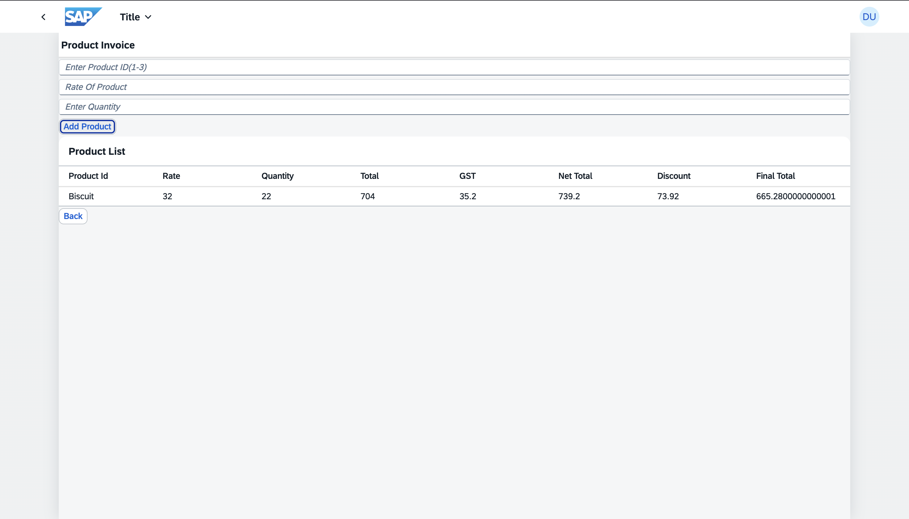

# 👨‍💼 EmployUi - SAPUI5 App

A clean and responsive SAPUI5-based frontend application to manage employee-related data and also a product invoice.  
Built using modern UI5 practices and ready to connect with OData or RAP services.

---

## 🔧 Tech Stack

- SAPUI5
- JavaScript
- UI5 Tooling
- Works with OData V4 (backend ready)
- View Navigation 

## 📂 Project Structure

A brief overview of the main directories and files:

```EmployUi/
├── webapp/                 # Contains all the UI5 application code
│   ├── controller/         # Logic for the views (e.g., Employee and Invoice controllers)
│   ├── view/               # XML views (UI definitions for EmployeeList, InvoiceDetail, etc.)
│   ├── model/              # Data models and helper classes
│   ├── i18n/               # Internationalization texts
│   ├── css/                # Custom CSS styles
│   ├── component.js        # Main entry point for the UI5 application
│   └── manifest.json       # Application descriptor (config, models, routing, etc.)
├── ui5.yaml                # UI5 CLI configuration
├── package.json            # Node.js project configuration and scripts
├── .gitignore              # Files to be ignored by Git
└── README.md               # This file 
```


## How to Run Locally
```
Open BTP cockpit
copy
paste
in bash
npm install
npm start
This will typically open the application in your default browser at `http://localhost:8080`
```

✍️ Author
```
Ashwani Singh
GitHub: AshwaniSingh00

📜 License
For personal learning and demo purposes.
## 🖼️ Application Screenshots
```
### 🔐 Login Page

### 💼 Salary Slip Generator


### 🧾 Product Invoice

